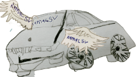
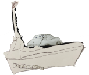
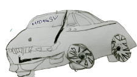

## Suitecase's Garden  in Garden Island

**_Suitecase is vacationing in garden island. (As you know he lives in the sky on many islands)._**

_Suitecase wants to tell you his secret of  how to grow a garden of vegetables and feed the world._

_To grow the garden he needs to go around the world._

_Because he needs correct supplies to grow._

_The supplies are different seeds, special fertilizers, special soil._

_So to travel he built car named it SonicFlyer._

### My SonicFlyer Modes

| Air Mode        | Sea Mode          | Land Mode |
|:-------------|:------------------|:------|
|  "Air" | "Sea" |  "Land"|

<b>Drawing by ramacsv - SuiteCase's Friend</b>

_The car has modes. There is a tree mode, flying mode, sail mode, and glide mode._

_He picked flying mode to go to travel._

_After landing he changed the mode to road and drive._

_First he went to India to get tropical different  vegetable seeds_

| India        |
|:-------------|
|  "Air" |

_Peas, types of dry beans, corn, gourd, squash, cucumber, red and green chili peppers, cumin, black pepper, fenugreek,mustard, sesame, root vegetables._

_Next he went to Africa to get cocoa seeds that is used to make coco and chocolate._

_He got shea seeds to make shea butter for healing lotions._

_Next stop was South America. Got some good fertilizer._

_He switched his car to mode to sail and sailed to Europe._

_There ha got grape seeds and soil._

_His car was getting full so he switched the mode to flying and flew back to garden island with all the supplies._

_He rake the garden, put the soil and fertilizer, turned on the sprinkler to make the growing field ready._

_He made special groups for different seed and planted the seeds in there._

_He put a good fence to keep out animals eating the plants and vegetables_

_He has a drone. The drone pilots over the garden._

_He has connected the drone remotely to his computer._

_When  there is a bird coming to eat, the drone swoops down._

_Then the bird lands on top of the drone._

_The drone starts  simulates crashing into a tree that makes the bird fly away_

_He took care garden very well._

_The garden grew very well, lots of flowers blossomed._

_All the vegetables grew well._

_He gave it to every one It was so good every one  liked it._

_All of them thanked him for such a treat_

_Hope you like the story_

### Appreciate you visiting my page. 

### **The End**

### **Thank you.** 
